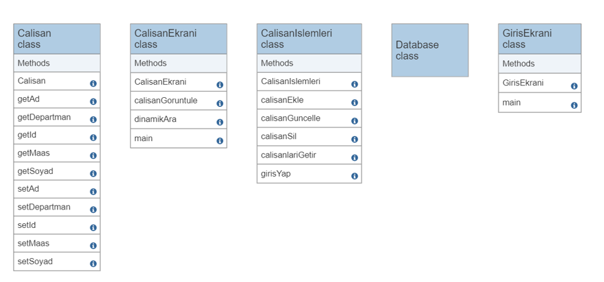

# Employee Management System

Bu proje, Java ile geliştirilmiş bir **çalışan yönetim sistemi** uygulamasıdır. Amaç; kullanıcıların çalışanlara ait verileri kolayca görüntüleyebileceği, güncelleyebileceği ve filtreleyebileceği kullanıcı dostu bir arayüz sağlamaktır.

---

## 🎯 Projenin Amacı

Bu uygulama, şirket veya kurumlarda çalışan bilgilerini düzenli, merkezi ve etkileşimli bir şekilde yönetmek amacıyla geliştirilmiştir. Kullanıcı girişinden sonra çalışanların bilgileri görüntülenebilir, yeni çalışanlar eklenebilir, mevcut bilgiler düzenlenebilir ve istenilen kritere göre filtrelenebilir. Tüm işlemler anlık olarak veritabanına kaydedilir.

---

## 🧩 Temel Özellikler

- 🔐 Kullanıcı doğrulamalı giriş ekranı
- 📋 Çalışan kayıtlarını listeleme, ekleme, silme ve güncelleme
- 🔍 Dinamik arama (isim, departman, maaş gibi kriterlerde)
- 💾 JDBC ile veritabanı bağlantısı ve veri eşitleme
- 🖥️ Basit ve kullanıcı dostu grafik arayüz

---

## 📦 Kullanılan Teknolojiler

- **Java SE (Swing GUI)**
- **JDBC** – Veritabanı bağlantısı için
- **MySQL** – Veri saklama ve sorgulama için
- **NetBeans** – IDE (Geliştirme Ortamı)

---

## 🧱 Sınıf Diyagramı

Aşağıda projenin sınıf yapısını gösteren UML diyagramı yer almaktadır:



---

## 🗂️ Sınıflar ve Görevleri

| Sınıf Adı           | Görevi |
|---------------------|--------|
| `Calisan`           | Çalışan verilerini tutan model sınıf |
| `CalisanEkrani`     | Çalışan listesini ve arama işlemlerini yöneten arayüz |
| `CalisanIslemleri`  | Ekleme, silme, güncelleme ve sorgulama işlemleri |
| `Database`          | Veritabanı bağlantısını sağlayan sınıf |
| `GirisEkrani`       | Sisteme kullanıcı girişi yapılan arayüz |

---

## 🗄️ Veritabanı

Projeyle birlikte gelen `veri_tabani/` klasöründe SQL dökümleri yer alır:

- `demo.sql`: Tam veritabanı yapısı (adminler + calisanlar tabloları)
- `sena_adminler.sql`: Sadece admin giriş tablosu
- `sena_calisanlar.sql`: Sadece çalışanlar tablosu

---

## 🚀 Uygulamayı Çalıştırmak İçin

1. MySQL'de bir veritabanı oluştur (örneğin `calisan_sistemi`) ve `veri_tabani/demo.sql` dosyasını içeri aktar:

   ```bash
   mysql -u root -p calisan_sistemi < veri_tabani/demo.sql

2. `Database` sınıfı içindeki bağlantı bilgilerini (host, kullanıcı adı, şifre) kendine göre güncelle.
3. IDE üzerinden `GirisEkrani` sınıfını çalıştırarak uygulamayı başlat.

---

## 📜 Lisans

Bu proje eğitim ve öğrenme amaçlı geliştirilmiştir. Açık kaynak olarak geliştirilmeye açıktır.
